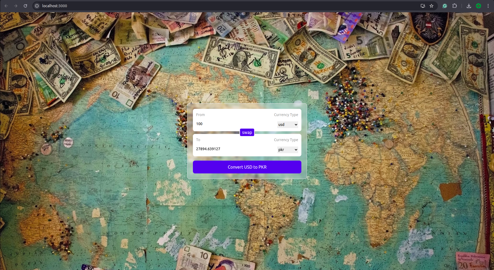

#  Universal Currency Converter

# Description
A user-friendly and dynamic currency converter built with React and a reliable API. Convert currencies in real-time, keeping you informed of the latest exchange rates.

## Available Scripts

In the project directory, you can run:

# Features:

**Real-time exchange rates** Leverage a powerful API to display accurate and up-to-date conversion rates. 
**Simple and intuitive interface** Convert currencies effortlessly with a clean and user-friendly design. 
**Multiple currencies** Support a wide range of currencies, allowing users to convert between popular and less common currencies. 
**Customizable conversion** Specify the amount you want to convert and see the results instantly. 

# Getting Started:

**Clone the repository** Use git clone https://github.com/your-username/currency-converter.git to clone this project. 
**Install dependencies** Run npm install in the project directory to install all required dependencies. 
**Start the development server** Run npm run dev to launch the application at http://localhost:3000 in your browser. 

# Usage

Open the application in your browser. 
Enter the amount you want to convert in the input field. 
Select the currency you want to convert from the dropdown menu. 
Select the currency you want to convert to from the other dropdown menu. 
The converted amount will be displayed automatically. 

